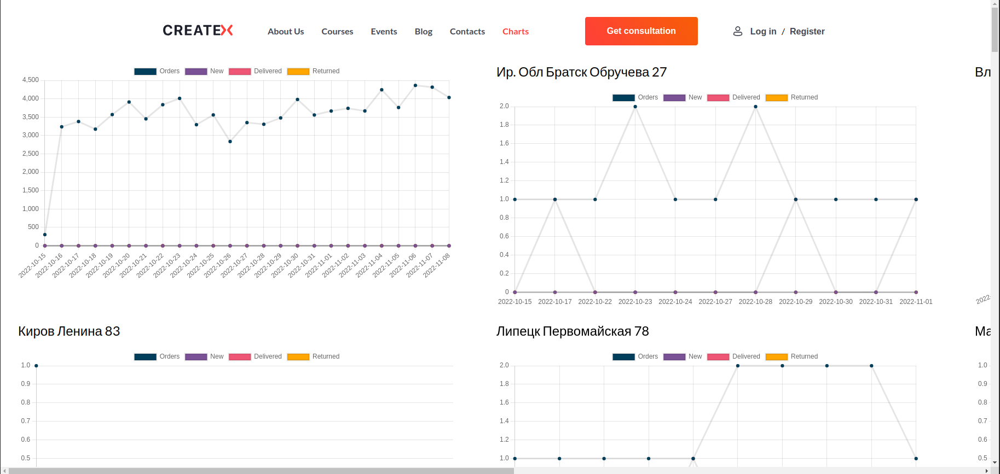
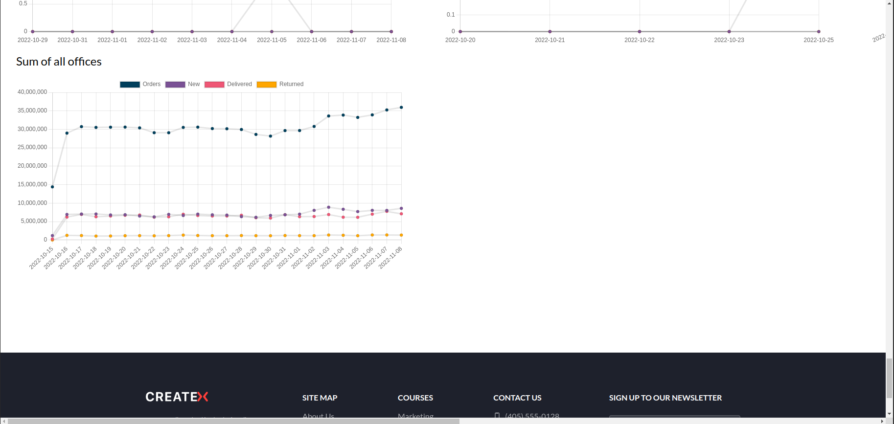

# Createx

## [Ссылка на сайт (страница /contacts)](https://nickgrief.github.io/createx-homework)

## [Ссылка на страницу /single-post](https://nickgrief.github.io/createx-homework/single-post)

### Дз №2

Добавил \*ngFor директиву для отображения иконок.

### Дз №3

Добавил страницу /singe-post, роутинг, собственную директиву и Angular Material.

### Дз №4

Добавил страницу /charts, содержащую графики по данным. В самом низу общий график с суммами данных.

## Скриншоты

### Страница /single-post

### Собственная директива

### Страница /contacts

### Страница /charts

### График суммы данных

